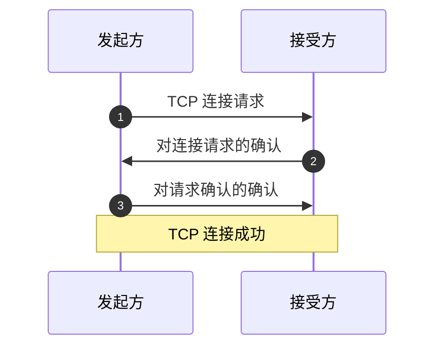
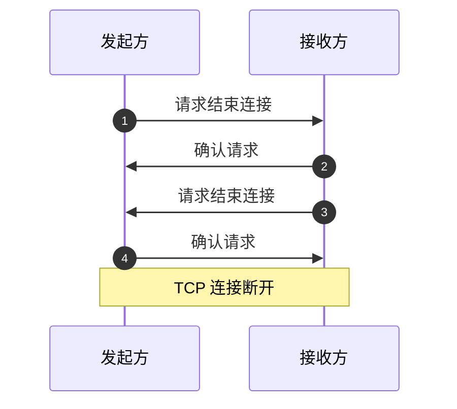

# TCP 协议

TCP 协议规定了两台计算机如何建立稳定的连接并双向传输数据。

## TCP 数据包

为了便于管理数据发送，TCP 协议要求在每次发送数据时在数据前添加一个 TCP 头部。

TCP 头部包含许多信息，如发送端口、接收端口、校验和等。

发送端口用于告诉接收方向什么地方传输数据，以此实现双向传输。

校验和用于校验数据传输的准确性和完整性，类似于身份证号的最后一位。

## 三次握手

在建立 TCP 连接时，发起方和接受方要完成总共三次握手。

## 四次挥手

在一方要结束 TCP 连接时，发起方和接收方要完成总共四次挥手。

因此，正常的连接解除需要双方做出确认。

发起方发出结束请求，且接受方确认后，双方仍然可以继续发送数据。

直到接受方也发送结束请求，发送方确认为止，才算连接断开。

## 超时重发

在 TCP 连接建立后，在每次数据发送完成后，接收方都需要向发送方发送一个确认信号。

如果接收方没有收到完整的数据，或者数据校验失败，那么不会发送确认信号。

发送方会提前设定一个时间阈值（由 TCP 协议中的特定算法计算得到）。

如果发送方在超过这个时间阈值还没有收到接收方发来的确认信号，就会认定数据发送失败。

当重发数据仍然未得到确认后，等待设定的时间阈值会被翻倍，然后再次重发。

如果多次重发未得到确认，则会判定网络或对方主机发生异常，强制关闭连接。
